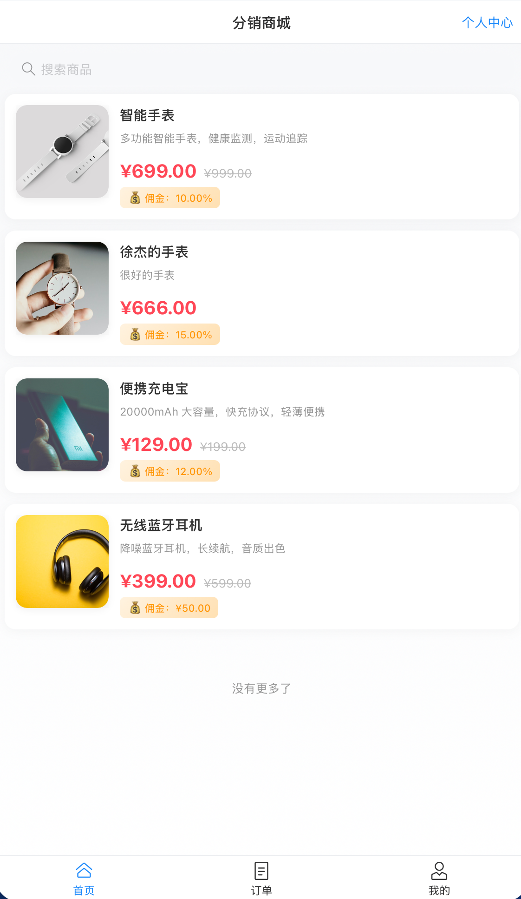
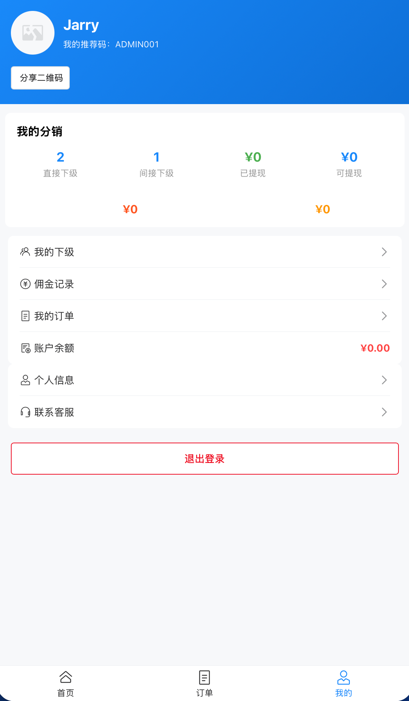
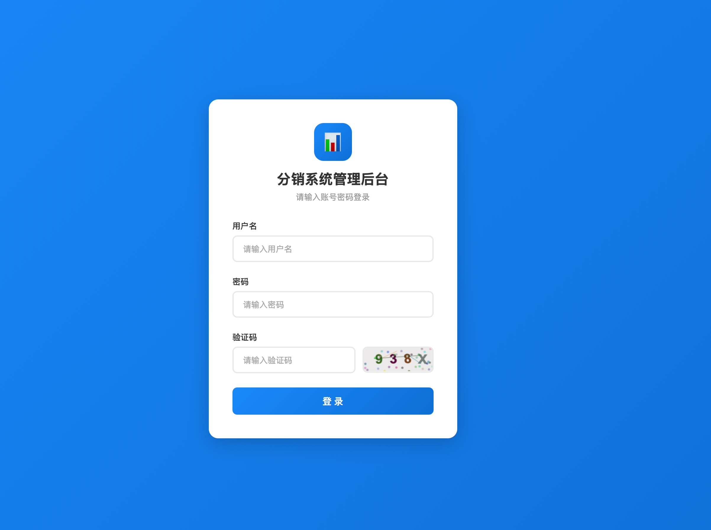
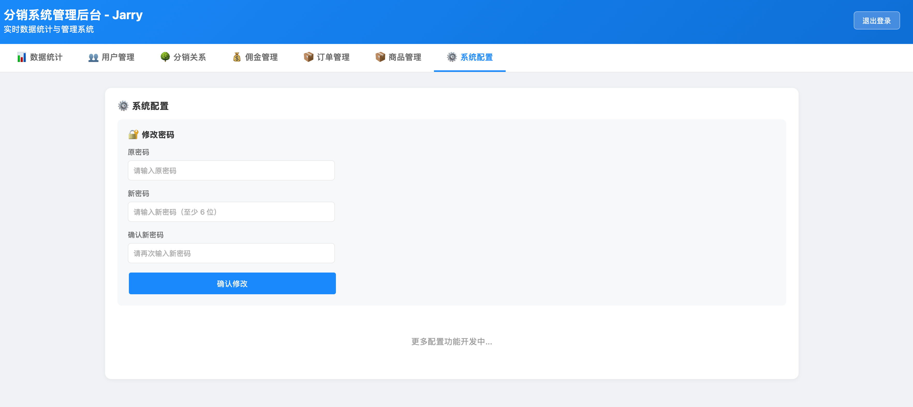

# 🛍️ 分销系统 - Distribution System

一个完整的电商分销系统，支持多级分销、佣金管理、订单跟踪等功能。

[](LICENSE)
[](https://nodejs.org/)
[](https://vuejs.org/)

---

## 📱 系统演示

### 移动端前端
**地址**: https://distribution-system-psi.vercel.app

**测试账号**:
- 用户名：`testuser`
- 密码：`123456`

### 管理后台
**地址**: https://distribution-system-admin.vercel.app

**管理员账号**:
- 用户名：`admin`
- 密码：`admin123`

### 后端 API
**地址**: https://distribution-system-production.up.railway.app

**健康检查**: https://distribution-system-production.up.railway.app/health

---

## 📸 系统截图

### 移动端页面

#### 登录注册
<table>
  <tr>
    <td align="center">
      
      <br/>
      <strong>登录页面</strong>
    </td>
    <td align="center">
      
      <br/>
      <strong>注册页面（支持推荐码）</strong>
    </td>
  </tr>
</table>

#### 商品浏览
<table>
  <tr>
    <td align="center">
      
      <br/>
      <strong>首页商品列表</strong>
    </td>
    <td align="center">
      
      <br/>
      <strong>商品详情页</strong>
    </td>
  </tr>
</table>

#### 订单管理
<table>
  <tr>
    <td align="center">
      
      <br/>
      <strong>订单列表</strong>
    </td>
    <td align="center">
      
      <br/>
      <strong>订单详情</strong>
    </td>
  </tr>
</table>

#### 个人中心
<table>
  <tr>
    <td align="center">
      
      <br/>
      <strong>个人中心</strong>
    </td>
    <td align="center">
      
      <br/>
      <strong>邀请海报（二维码）</strong>
    </td>
  </tr>
  <tr>
    <td align="center">
      
      <br/>
      <strong>下级列表</strong>
    </td>
    <td align="center">
      
      <br/>
      <strong>佣金记录</strong>
    </td>
  </tr>
</table>

---

### 管理后台页面

#### 登录页面
<table>
  <tr>
    <td align="center">
      
      <br/>
      <strong>管理后台登录（带验证码）</strong>
    </td>
  </tr>
</table>

#### 数据统计
<table>
  <tr>
    <td align="center">
      
      <br/>
      <strong>数据统计看板</strong>
    </td>
  </tr>
</table>

#### 用户管理
<table>
  <tr>
    <td align="center">
      
      <br/>
      <strong>用户管理（禁用/启用、重置密码、删除）</strong>
    </td>
  </tr>
</table>

#### 商品管理
<table>
  <tr>
    <td align="center">
      
      <br/>
      <strong>商品管理（上下架、编辑、删除）</strong>
    </td>
  </tr>
</table>

#### 订单管理
<table>
  <tr>
    <td align="center">
      
      <br/>
      <strong>订单管理（查看、发货）</strong>
    </td>
  </tr>
</table>

#### 佣金管理
<table>
  <tr>
    <td align="center">
      
      <br/>
      <strong>佣金管理（发放佣金）</strong>
    </td>
  </tr>
</table>

#### 系统配置
<table>
  <tr>
    <td align="center">
      
      <br/>
      <strong>修改密码</strong>
    </td>
  </tr>
</table>

---

## ✨ 核心功能

### 📱 移动端功能

- ✅ **用户认证**
  - 登录/注册
  - 推荐码绑定（自动建立分销关系）
  - 个人信息管理
  - 头像上传（base64）
  - 密码修改

- ✅ **商品系统**
  - 商品列表（无限滚动）
  - 商品搜索
  - 商品详情
  - 佣金信息展示
  - 分享功能

- ✅ **订单系统**
  - 创建订单
  - 订单列表（状态筛选）
  - 订单详情
  - 模拟支付
  - 确认收货

- ✅ **分销系统**
  - 个人邀请海报（二维码）
  - 下级列表（直接/间接）
  - 佣金记录
  - 分销统计
  - 余额查看

### 🖥️ 管理后台功能

- ✅ **数据统计**
  - 用户统计（总数、今日新增）
  - 订单统计（总数、今日订单）
  - 销售统计（总额、今日销售）
  - 佣金统计（已发放、待发放）
  - 商品统计

- ✅ **用户管理**
  - 用户列表
  - 禁用/启用用户
  - 重置用户密码
  - 删除用户（保护管理员）

- ✅ **商品管理**
  - 商品列表
  - 添加商品
  - 编辑商品
  - 上下架商品
  - 删除商品（回收到回收站）
  - 批量操作
  - 回收站管理

- ✅ **订单管理**
  - 订单列表
  - 订单详情
  - 订单发货
  - 订单状态管理

- ✅ **佣金管理**
  - 佣金列表
  - 佣金发放
  - 发放记录

- ✅ **系统安全**
  - 登录验证码
  - 会话管理
  - 关闭浏览器需重新登录
  - 管理员权限验证

---

## 🏗️ 系统架构

```
┌─────────────────────────────────────────────────────────┐
│                     用户层                               │
├──────────────────────┬──────────────────────────────────┤
│   移动端 (Vercel)    │      管理后台 (Vercel)           │
│  distribution-system │  distribution-system-admin       │
│     -psi.vercel.app  │      .vercel.app                 │
└──────────┬───────────┴────────────┬─────────────────────┘
           │                        │
           │   API 调用 (HTTPS)      │
           ↓                        ↓
┌─────────────────────────────────────────────────────────┐
│              后端 API (Railway)                         │
│   distribution-system-production.up.railway.app        │
│                                                         │
│  ┌─────────────┬──────────────┬──────────────┐        │
│  │  认证模块   │  商品模块    │  订单模块    │        │
│  ├─────────────┼──────────────┼──────────────┤        │
│  │  分销模块   │  佣金模块    │  管理模块    │        │
│  └─────────────┴──────────────┴──────────────┘        │
└────────────────────────┬────────────────────────────────┘
                         │
                         │  Sequelize ORM
                         ↓
┌─────────────────────────────────────────────────────────┐
│           数据库 (Supabase PostgreSQL)                  │
│                                                         │
│  ┌──────┬──────┬───────┬───────┬────────┬────────┐    │
│  │ users│products│orders│order_items│commissions│... │    │
│  └──────┴──────┴───────┴───────┴────────┴────────┘    │
└─────────────────────────────────────────────────────────┘
```

---

## 📁 项目结构

```
distribution-system/
├── backend/                          # 后端 API
│   ├── src/
│   │   ├── config/
│   │   │   └── database.js          # 数据库配置
│   │   ├── models/                  # Sequelize 模型
│   │   │   ├── User.js
│   │   │   ├── Product.js
│   │   │   ├── Order.js
│   │   │   ├── OrderItem.js
│   │   │   ├── Commission.js
│   │   │   ├── Referral.js
│   │   │   └── index.js
│   │   ├── controllers/             # 控制器
│   │   │   ├── authController.js    # 认证（登录、注册、修改密码）
│   │   │   ├── productController.js # 商品管理
│   │   │   └── adminController.js   # 管理后台
│   │   ├── middleware/
│   │   │   ├── auth.js              # JWT 认证
│   │   │   └── upload.js            # 文件上传（base64）
│   │   ├── routes/                  # 路由配置
│   │   │   ├── auth.js
│   │   │   ├── products.js
│   │   │   └── admin.js
│   │   └── index.js                 # 入口文件
│   ├── package.json
│   └── .env.example
│
├── mobile-frontend/                  # 移动端前端
│   ├── src/
│   │   ├── api/                     # API 封装
│   │   │   ├── request.js
│   │   │   ├── auth.js
│   │   │   └── product.js
│   │   ├── stores/                  # Pinia 状态管理
│   │   │   └── user.js
│   │   ├── router/                  # 路由配置
│   │   │   └── index.js
│   │   ├── views/                   # 页面组件
│   │   │   ├── Login.vue
│   │   │   ├── Register.vue
│   │   │   ├── Home.vue
│   │   │   ├── ProductDetail.vue
│   │   │   ├── OrderList.vue
│   │   │   ├── Profile.vue
│   │   │   ├── Referees.vue
│   │   │   ├── Commissions.vue
│   │   │   ├── InvitePoster.vue
│   │   │   └── Order.vue
│   │   ├── App.vue
│   │   └── main.js
│   ├── index.html
│   ├── package.json
│   └── vite.config.js
│
├── admin-frontend/                   # 管理后台
│   ├── login.html                   # 登录页面（带验证码）
│   ├── index.html                   # 主页面
│   ├── product-add.html             # 添加商品
│   ├── product-edit.html            # 编辑商品
│   └── src/                         # 源代码
│
└── docs/
    └── screenshots/                 # 系统截图
        ├── mobile-login.png
        ├── mobile-register.png
        ├── mobile-home.png
        ├── mobile-product-detail.png
        ├── mobile-order-list.png
        ├── mobile-profile.png
        ├── mobile-invite-poster.png
        ├── mobile-referees.png
        ├── mobile-commissions.png
        ├── admin-login.png
        ├── admin-dashboard.png
        ├── admin-users.png
        ├── admin-products.png
        ├── admin-orders.png
        ├── admin-commissions.png
        └── admin-settings.png
```

---

## 🚀 快速开始

### 方式一：使用部署好的系统（推荐）

直接访问在线系统：
- **移动端**: https://distribution-system-psi.vercel.app
- **管理后台**: https://distribution-system-admin.vercel.app
- **API**: https://distribution-system-production.up.railway.app

### 方式二：本地部署

#### 1. 环境要求

- Node.js >= 14
- PostgreSQL >= 12 或 Supabase 账号

#### 2. 克隆项目

```bash
git clone https://github.com/xtit/distribution-system.git
cd distribution-system
```

#### 3. 数据库配置

使用 Supabase（推荐）:
1. 访问 https://supabase.com 创建项目
2. 获取数据库连接字符串
3. 执行 `backend/supabase-init.sql` 初始化数据库

或使用本地 PostgreSQL:
```bash
createdb distribution_system
psql distribution_system < backend/supabase-init.sql
```

#### 4. 后端启动

```bash
cd backend

# 安装依赖
npm install

# 配置环境变量
cp .env.example .env
# 编辑 .env，设置 DATABASE_URL 等

# 开发模式
npm run dev

# 生产模式
npm start
```

#### 5. 移动端前端启动

```bash
cd mobile-frontend

# 安装依赖
npm install

# 开发模式
npm run dev

# 访问 http://localhost:5173
```

#### 6. 管理后台

直接打开 `admin-frontend/index.html` 或部署到 Vercel。

---

## 🔑 默认账号

### 管理后台
- **用户名**: `admin`
- **密码**: `admin123`
- **权限**: 完整管理权限

### 测试用户
- **用户名**: `testuser`
- **密码**: `123456`
- **权限**: 普通用户权限

---

## 📊 数据库表结构

| 表名 | 说明 | 主要字段 |
|------|------|----------|
| `users` | 用户表 | 用户名、密码、昵称、推荐码、余额、状态 |
| `products` | 商品表 | 商品名、价格、库存、佣金配置 |
| `orders` | 订单表 | 订单号、用户、金额、状态 |
| `order_items` | 订单商品 | 订单、商品、数量、价格 |
| `commissions` | 佣金表 | 用户、订单、金额、状态 |
| `referrals` | 分销关系 | 推荐人、被推荐人、层级 |

---

## 🔐 安全特性

- ✅ JWT Token 认证
- ✅ 密码加密存储（bcrypt）
- ✅ 登录验证码
- ✅ 会话管理（关闭浏览器需重新登录）
- ✅ 管理员权限验证
- ✅ SQL 注入防护（Sequelize ORM）
- ✅ XSS 防护
- ✅ CORS 配置

---

## 🛠️ 技术栈

### 后端
- **运行环境**: Node.js 14+
- **框架**: Express
- **ORM**: Sequelize
- **数据库**: PostgreSQL / Supabase
- **认证**: JWT (jsonwebtoken)
- **加密**: bcryptjs
- **文件处理**: Multer (base64)

### 移动端
- **框架**: Vue 3
- **UI 库**: Vant 4
- **状态管理**: Pinia
- **路由**: Vue Router
- **构建工具**: Vite
- **HTTP**: Axios

### 管理后台
- **纯 HTML + JavaScript**
- **轻量级设计**
- **易于部署**

### 部署平台
- **前端**: Vercel
- **后端**: Railway
- **数据库**: Supabase

---

## 📝 开发日志

- **2026-03-24**: 
  - ✅ 添加用户管理功能（禁用/启用、重置密码、删除）
  - ✅ 添加修改密码功能
  - ✅ 管理后台登录（带验证码）
  - ✅ 二维码 base64 存储
  - ✅ 头像 base64 上传
  - ✅ 修复所有已知问题

- **2026-03-23**: 
  - ✅ 后端迁移到 Railway
  - ✅ 数据同步完成
  - ✅ 佣金管理修复

- **2026-03-21**: 
  - ✅ 移动端功能完善
  - ✅ 管理后台功能恢复
  - ✅ 图片上传优化

- **2026-03-20**: 
  - ✅ 核心功能开发完成
  - ✅ 数据库设计完成
  - ✅ API 接口开发完成

- **2026-03-19**: 
  - ✅ 项目初始化
  - ✅ 技术选型

---

## 📚 文档

- [部署指南](./docs/部署指南.md)
- [API 文档](./docs/API 文档.md)
- [用户手册](./docs/用户手册.md)
- [开发日志](./docs/开发日志.md)

---

## 🤝 贡献

欢迎提交 Issue 和 Pull Request！

---

## 📄 License

MIT License

---

## 📞 联系方式

- **GitHub**: https://github.com/xtit/distribution-system
- **邮箱**: xjy@xtit.net

---

**最后更新**: 2026-03-24 17:50 GMT+8
